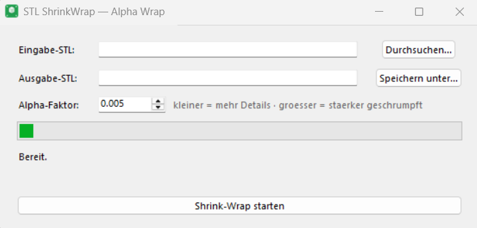

# STL ShrinkWrap

> A tiny, no-install Windows desktop app to **shrink-wrap STL files** using
> alpha wrapping — pick a file, set one slider, done.

[](LICENSE)


STL ShrinkWrap turns a messy, multi-part, or non-watertight mesh into a single
clean, watertight shell — perfect for 3D printing, simplifying assemblies, or
creating supports/negatives. It wraps the wonderful **[PyMeshLab](https://github.com/cnr-isti-vclab/PyMeshLab)**
`generate_alpha_wrap` filter in a friendly one-window GUI.



---

## ⬇️ Download & run (no Python needed)

1. Go to the [**Releases**](../../releases) page and download a portable ZIP:
   - `STL-ShrinkWrap-Portable.zip` — starts in **German**
   - `STL-ShrinkWrap-Portable-EN.zip` — starts in **English**
2. **Unzip the whole folder** somewhere (Desktop is fine).
3. Double-click **`STL-ShrinkWrap.exe`**.

That's it — no installation, no Python, no internet connection. A complete Python
runtime (with PyMeshLab) ships inside the `python\` subfolder.

> **Language:** both downloads contain the **same app** with a **DE/EN switcher**
> in the top-right corner — the only difference is which language they start in.
> So either ZIP works; pick whichever default you prefer.

> **When sharing:** always pass on the **entire folder** (or the `.zip`), not just
> the `.exe`. The launcher needs the `python\` folder and `stl_shrinkwrap.py`
> next to it.

---

## ✨ Usage

1. **Input STL** — choose your file.
2. **Output STL** — auto-suggested as `… wrap.stl`, editable.
3. **Alpha factor** — the *only* knob you need (default `0.005`):
   - **smaller** → finer detail, hull hugs the model more tightly
   - **larger** → coarser, more aggressively shrunk
4. Click **Start**. A running bar + elapsed time shows it's working.

You can switch the interface language (Deutsch / English) anytime via the
dropdown in the top-right corner.

### Why only one parameter?
PyMeshLab's `generate_alpha_wrap` has two: `alpha_fraction` (how tightly the hull
follows the surface — the one you set) and `offset_fraction` (the hull's wall
thickness). In practice you always leave the offset at its default, so the app
hides it to keep things simple.

---

## 🙏 Powered by PyMeshLab — thank you!

**This app simply would not exist without [PyMeshLab](https://github.com/cnr-isti-vclab/PyMeshLab).**

All of the actual heavy lifting — reading the mesh, the entire alpha-wrapping
computation, and writing the result — is done by PyMeshLab and the libraries it
builds on. STL ShrinkWrap is, honestly, just a thin, friendly front-end around a
single PyMeshLab call. The PyMeshLab team has packaged the enormous power of
**[MeshLab](https://www.meshlab.net/)** and **[CGAL](https://www.cgal.org/)** into
a clean, scriptable Python API that "just works" — and that is a genuinely
fantastic piece of open-source engineering. Endless thanks to
**Alessandro Muntoni** and **Paolo Cignoni** (CNR-ISTI, Visual Computing Lab) and
all MeshLab/CGAL contributors.

If you use this app, you are really using *their* work. Please consider starring
[PyMeshLab](https://github.com/cnr-isti-vclab/PyMeshLab) and citing it:

```bibtex
@software{pymeshlab,
  author    = {Alessandro Muntoni and Paolo Cignoni},
  title     = {{PyMeshLab}},
  year      = {2021},
  publisher = {Zenodo},
  doi       = {10.5281/zenodo.4438750}
}
```

The alpha-wrapping itself comes from **CGAL's "3D Alpha Wrapping"** package — also
a remarkable achievement worth a look.

---

## 🛠 How it works

Under the hood it's essentially your one-liner, wrapped in a GUI and run in a
background process so the window never freezes:

```python
import pymeshlab
ms = pymeshlab.MeshSet()
ms.load_new_mesh("input.stl")
ms.generate_alpha_wrap(alpha_fraction=0.005)
ms.save_current_mesh("output wrap.stl")
```

Small robustness touches on top: input/output are staged through ASCII temp paths
(so filenames with umlauts/spaces work), and meshes with no geometry are rejected
with a clear message instead of crashing.

### Why a portable Python folder instead of one single `.exe`?
Bundling PyMeshLab into a single PyInstaller `--onefile` executable was tested and
**does not work reliably** — PyMeshLab's native CGAL/Qt module crashes on load when
frozen (access violation `0xC0000005`), in both `--onefile` and `--onedir` modes.
So the app ships a real, complete Python interpreter (the one that loads PyMeshLab
correctly) alongside a tiny launcher `.exe`. Same double-click experience, just a
folder instead of one file — and it's rock solid.

---

## 👩‍💻 Build from source

Requires a Python (3.9–3.12) with `pymeshlab` installed.

```bash
pip install pymeshlab
python stl_shrinkwrap.py
```

To rebuild the portable, no-Python bundle, run **`build_portable.bat`** (Windows).
It copies a working Python+PyMeshLab into `STL-ShrinkWrap-Portable\python\`, adds
the script, generates the icon, and builds the launcher `.exe`.

| File | Purpose |
|---|---|
| `stl_shrinkwrap.py` | The app (GUI + worker, single file) |
| `launcher.py` | Source of the tiny launcher `.exe` |
| `generate_icon.py` | Generates `icon.ico` (needs Pillow) |
| `build_portable.bat` | Rebuilds the portable bundle |
| `START.bat` | Run from source (creates a local `.venv`) |
| `requirements.txt` | `pymeshlab` |

---

## 📜 License

STL ShrinkWrap is licensed under the **GNU General Public License v3.0** — see
[`LICENSE`](LICENSE). It must be GPL-3.0 because it uses PyMeshLab, which is
GPL-3.0. You are free to use, study, share, and modify it; derivatives must stay
GPL-3.0 and ship their source.

Bundled third-party components and their licenses are listed in
[`THIRD_PARTY_NOTICES.md`](THIRD_PARTY_NOTICES.md) (PyMeshLab/MeshLab/CGAL =
GPL-3.0, Qt 5 = LGPL-3.0, Python = PSF, NumPy = BSD).

## 🔒 Privacy
Fully offline. No telemetry, no network access, no accounts. The app only reads
your chosen STL and writes the result.
